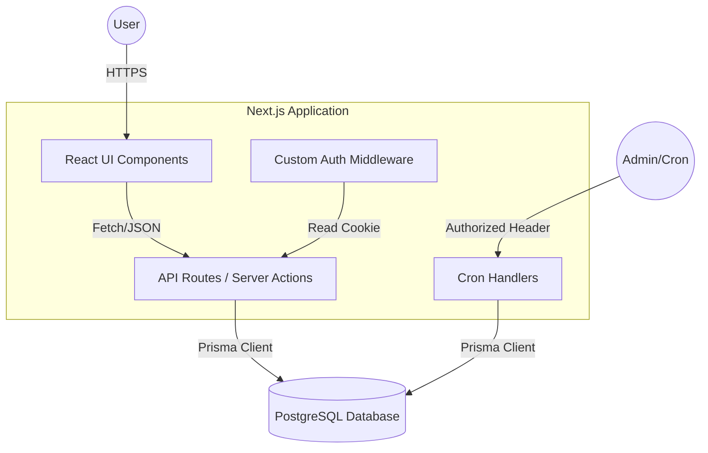
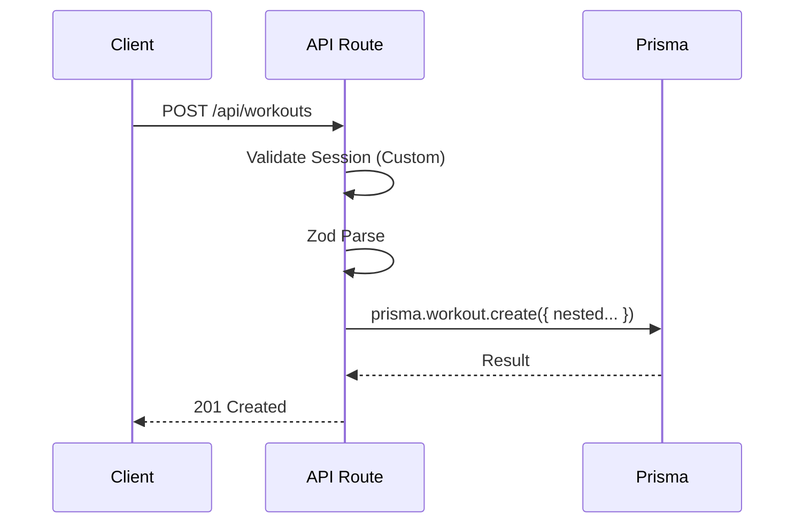

# Arch-G3 Architectural Analysis Report: Workout Tracker

**Date:** 2025-12-21
**Target System:** `workout-tracker` (Next.js 14 App Router)
**Analyzer:** Arch-G3 (Gemini 3 Pro)

---

## 1. Executive Summary

The `workout-tracker` is a sophisticated fitness application built on the modern Next.js stack. It features a rich domain model including social networking, gamification (XP/Levels), and real-time party modes. While the structural foundation is sound (App Router, Prisma, Tailwind), the application exhibits "Monolithic Controller" anti-patterns where complex business logic is coupled tightly to HTTP handlers. Security is managed via a custom JWT implementation, which introduces unnecessary risk compared to standard solutions like NextAuth.

---

## 2. Structural Mapping

### 2.1 High-Level Architecture (C4 Context)



### 2.2 Directory Taxonomy

- **`src/app`**: Routing & Controllers. (Hybrid: UI Pages + API Endpoints).
- **`src/lib`**: Infrastructure & Utilities. Contains DB singleton (`prisma.ts`) and Auth logic (`auth.ts`).
- **`src/components`**: UI Library. Modularized (Radix UI primitives).
- **`prisma`**: Data Definition. Contains the source of truth for the domain model.

---

## 3. Core Logic Analysis

### 3.1 The "Fat Controller" Problem
In `src/app/api/workouts/route.ts`, the POST handler manages:
1.  Session validation.
2.  Request body parsing (Zod).
3.  Complex nested writes (Workout -> Exercises -> Sets).
4.  Error handling.

**Current Flow (Implicit):**


**Deficiency:** There is no explicit "Service Layer" to handle side effects. For example, if a user finishes a workout, the system *should* trigger `UpdateUserXP`, `CheckQuestCompletion`, or `NotifyFollowers`. Currently, this logic is either missing from the creation flow or must be jammed into the same API handler, leading to unmaintainable code.

---

## 4. Deep Code Audit

### Dimension A: Architectural Integrity
- **Pattern:** MVC (Model-View-Controller).
- **Violation:** Leaky Abstractions. The API route knows too much about the specific Prisma nested write structure.
- **Consistency:** Import styles vary. `import prisma` (default) vs `import { prisma }` (named) usage was detected across different files.

### Dimension B: Performance & Scalability
- **Real-time:** The "Workout Party" feature relies on DB state. Without WebSockets, clients must poll the API. This will cause a massive spike in DB reads (`SELECT * FROM party_events`) as user base grows.
- **Cron Jobs:** The `cleanup-parties` endpoint relies on an external trigger. If the trigger fails, the DB accumulates stale data.

### Dimension C: Security Posture
- **Auth:** Custom JWT implementation (`src/lib/auth.ts`) is "Roll Your Own Crypto" adjacent. While it uses `bcrypt` and `jwt` correctly, it lacks features like Refresh Tokens, CSRF protection (beyond SameSite), and OAuth provider support.
- **Cron:** Protected by `CRON_SECRET` header. Good practice.

### Dimension D: Maintainability
- **Schema:** The `schema.prisma` is very comprehensive and well-modeled. Relationships are clear.
- **Types:** Excellent use of TypeScript and Zod.

---

## 5. Proposed Refactoring

### 5.1 Quick Wins (Low Effort / High Impact)

| File Path | Issue | Fix |
|-----------|-------|-----|
| `src/lib/prisma.ts` | Inconsistent Export | Standardize on `export const prisma = ...` (named export) to match cron usage and avoid singleton duplication issues in dev. |
| `src/app/api/workouts/route.ts` | Missing Validation | Ensure `limit` param in GET is capped (e.g., max 100) to prevent deep pagination DoS. |
| `src/lib/auth.ts` | Error Suppression | `verifyToken` swallows all errors. Log specific errors (Expired vs Malformed) for debugging. |

### 5.2 Major Refactoring: Introduce Service Layer

**Current State:**
API Routes directly call `prisma.model.create()`.

**Future State:**
API Routes call `WorkoutService.createWorkout()`. The Service handles DB writes + Gamification triggers.

**Migration Strategy:**
1.  Create `src/services/workout.service.ts`.
2.  Move the `prisma.workout.create` logic there.
3.  Inject an `EventBus` or direct calls to `GamificationService` within the `createWorkout` method.

**Code Snippet (Service Pattern):**

```typescript
// src/services/workout.service.ts
import { prisma } from '@/lib/prisma';
import { processGamification } from './gamification.service';

export class WorkoutService {
  static async create(userId: string, data: CreateWorkoutDTO) {
    return await prisma.$transaction(async (tx) => {
      // 1. Create Workout
      const workout = await tx.workout.create({ ... });
      
      // 2. Trigger Side Effects (Async or Sync)
      await processGamification(userId, workout, tx);
      
      return workout;
    });
  }
}
```

### 5.3 Major Refactoring: Migrate to NextAuth.js

Replace `src/lib/auth.ts` with NextAuth v5 (Auth.js).
- **Why:** Removes maintenance burden of custom JWT, adds OAuth (Google/Apple login), handles session rotation/security automatically.

---

## 6. Critical Q&A Preparation

1.  **Business Logic:** "When a user logs a workout, does the system immediately calculate 'Muscle Recovery' stats, or is that a scheduled background job? The current API route suggests it's not happening on creation."
2.  **Scale:** "For 'Workout Parties', are you planning to stick with polling? At >100 concurrent users, this will DDOS your database. Shall we introduce a Redis/WebSocket layer?"
3.  **Security:** "Is the `CRON_SECRET` variable set in your Vercel/Production environment? If missing, the cleanup endpoints are open to the public."

---
*End of Report*
